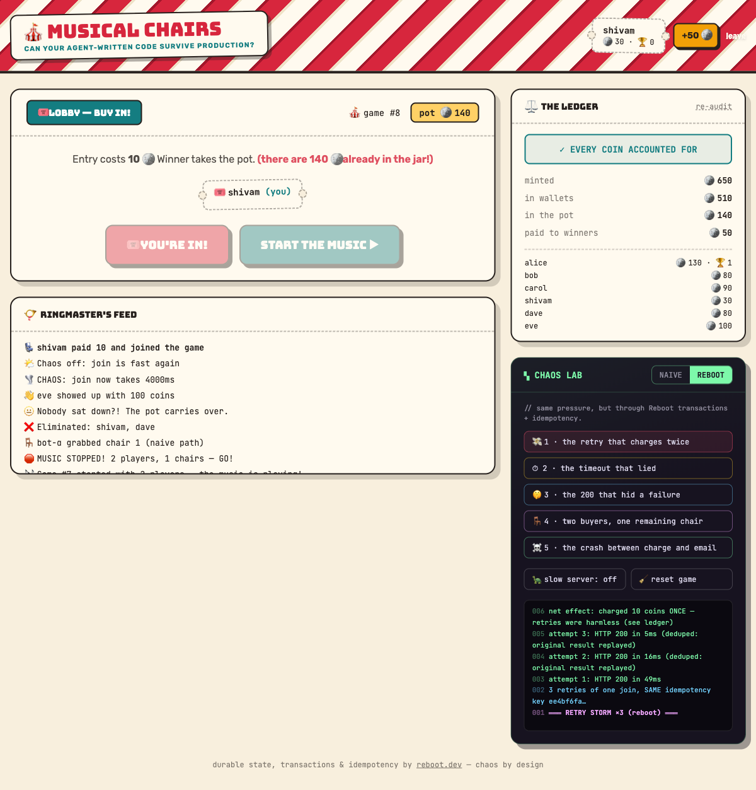

# 🎪 Musical Chairs — a production-reliability carnival

**Reboot × HackerSquad Hack Night: "Can Your Agent-Written Code Survive Production?"**

Musical Chairs where every round costs coins — because nothing surfaces
distributed-systems bugs like money and a shared limited resource. Players pay
10 🪙 to enter, the music stops, everyone scrambles for N−1 chairs, the winner
takes the pot. The game is real and multiplayer (open two browser tabs), but
the point is the **Chaos Lab**: a panel that injects all five of the event's
failure modes on demand, in two modes:

- **NAIVE** — raw REST calls written the way happy-path code (and happy-path
  coding agents) write them: two requests where one transaction belongs, blind
  retries, status-code-only error handling, check-then-act races.
- **REBOOT** — the same pressure hitting [Reboot](https://reboot.dev)
  transactions, idempotency keys, serialized writers, and durable scheduled
  tasks.

A live **Ledger** audits the books after every action: every coin ever minted
must equal wallets + pot. When a naive flow loses or conjures money, the
ledger turns red and tells you exactly how many coins are unaccounted for.



## Stack

- **Backend:** Python + [Reboot](https://reboot.dev) 1.4.0 (durable state
  machines; pydantic-defined API in `api/chairs/v1/`)
- **Frontend:** React 19 + Vite + Tailwind, using Reboot's generated reactive
  hooks (`rbt generate --react`)
- **Tests:** pytest + `reboot.aio.tests.Reboot` (in-process cluster)

## Run it

```bash
python3 -m venv .venv && source .venv/bin/activate
pip install reboot pydantic pytest
(cd frontend && npm install)

rbt dev run                      # terminal 1 — backend (+ Envoy proxy)
cd frontend && npm run dev       # terminal 2 — Vite HMR

open http://127.0.0.1:9991/      # each browser tab/device is a player
```

> **Use `127.0.0.1`, not `localhost`.** Browsers accumulate cookies for
> `localhost` across every dev project you've ever run; past ~8KB of them the
> proxy rejects requests with gRPC error 8 ("received metadata size exceeds
> soft limit"). Cookies are host-scoped, so `127.0.0.1` sidesteps the pile —
> arguably a sixth production failure mode, discovered live.

Run the reliability suite:

```bash
cd backend && ../.venv/bin/python -m pytest tests/reliability_test.py -q
# 8 passed
```

## The five failure modes

| # | Failure mode | Naive bug (reproducible in-app) | Hardened fix | Proof |
|---|---|---|---|---|
| 1 | **The retry that charges twice** | 3 blind retries of "join" → charged 3×, enrolled 3× (you appear in the lobby three times) | Every retry carries the same `x-reboot-idempotency-key` (a UUID minted once per logical action); the server replays the original result in ~5ms | Chaos Lab demo 1 · `test_retry_charges_exactly_once` |
| 2 | **The timeout that lied** | Client stops waiting at 600ms, assumes failure, re-charges; the "failed" charge lands 2s later → paid 20 for one seat | Timeout → re-send with the **same key** → await the one true outcome; charged exactly once | Chaos Lab demo 2 |
| 3 | **The 200 that hid a failure** | The payment endpoint returns `200 {"status":"ok","charged":false}`; caller checks only the status code and grants entry for free | Failures are **typed aborts** (`NotEnoughCoins`, `AlreadyJoined`, `ChairTaken`) that the generated client surfaces — there is no lying 200 to mis-read | Chaos Lab demo 3 · `test_broke_player_gets_typed_error`, `test_naive_200_hides_failed_charge` |
| 4 | **Two buyers, one remaining item** | Check-then-act: both clients read "chair available", both sit → one chair, two occupants 💥 | `claim` is a single **writer**; writers on a state are serialized, so the second claim gets a typed `ChairTaken` | Chaos Lab demo 4 · `test_two_players_one_chair`, `test_naive_check_then_act_overbooks` |
| 5 | **The crash between the charge and the email** | Charge succeeds, process dies before enroll → coins gone forever | `join` is one **distributed transaction** (Player.withdraw + Game enroll): commits or rolls back atomically. Payout is a durable **scheduled transaction** that survives restarts | Chaos Lab demo 5 · kill-test below · `test_join_never_half_happens`, `test_winner_paid_and_books_balance` |

### The kill test (run live)

```bash
# widen the window, fire a join, murder the server mid-transaction:
curl -XPOST localhost:9991/chairs.v1.GameMethods/SetChaos \
  -H "x-reboot-state-ref:chairs.v1.Game:the-game" -d '{"slowJoinMs":4000}'
curl -XPOST localhost:9991/chairs.v1.GameMethods/Join \
  -H "x-reboot-state-ref:chairs.v1.Game:the-game" -d '{"playerId":"eve"}' &
sleep 1.5 && pkill -9 -f "rbt dev run"

rbt dev run   # restart
# eve: {"coins": 100} — not charged, not enrolled. Ledger: missing = 0.
```

We ran exactly this: `kill -9` landed ~1.5s into the 4s transaction window.
After restart, eve had **100 coins and no enrollment** — the transaction
rolled back completely. Coin conservation held: `minted 650 = wallets 520 +
pot 130`. State (including the chaos flag itself) is durable across the crash.

## What the coding agent initially missed

Honest findings from this build session — each one is the kind of bug that
demos green and pages you at 3am:

1. **Idempotency keys must be UUIDs.** The first version used readable keys
   (`join-shivam-game-3`); every request failed server-side with
   `badly formed hexadecimal UUID string`. Worse, the chaos log's success
   message was printed unconditionally — **the demo itself was a "200 that
   hid a failure"** until the log lines were derived from actual responses.
2. **The client library can hang on duplicate in-flight mutations.** Re-sending
   the same idempotency key through the generated React hooks never resolved
   the promise (the server-side dedup worked — curl proved a 4ms replay). Fix:
   drive retries over raw HTTP with the `x-reboot-idempotency-key` header,
   which also makes the naive-vs-hardened comparison apples-to-apples: same
   `fetch`, one extra header.
3. **Aborting a socket cancels the server-side work.** The first
   "timeout that lied" demo used `AbortController` — and the "lost" charge
   *never landed*, because Reboot propagates client disconnect and cancels the
   writer. Correct simulation of an application-level timeout: stop *waiting*
   without killing the connection. (Also a genuinely nice property of the
   platform.)
4. **Opposite-sign corruption cancels out.** "10 coins vanished" (demo 5) plus
   "10 coins conjured" (demo 3) nets to zero — the conservation check went
   green while the books were cooked. Fix: the auditor now also tracks
   `unverified_fees` (pot contributions with no verified payment), which stays
   red regardless of arithmetic luck. Real ledgers track debits and credits,
   not just the net.
5. **Schema evolution is a production hazard too.** Adding a required field to
   a request model made the dev server refuse to start with a
   backwards-incompatibility error until the field got a default. Annoying for
   a hackathon; exactly what you want in production.

## Architecture notes

- `Game` is a singleton state machine (`LOBBY → MUSIC → SCRAMBLE → …`).
  Round transitions are **scheduled writer calls** (`stop_music`,
  `scramble_timeout`, `payout`) guarded by `(game_number, round_number)` so
  stale tasks no-op. Scheduled tasks are durable: they fire after a restart.
- `join` is a `Transaction` spanning `Player` (withdraw) and `Game`
  (pot + enrollment). `payout` is a `Transaction` spanning `Game` and the
  winner's `Player`.
- The naive endpoints (`enroll`, `naive_withdraw`, `naive_sit`,
  `chair_available`) exist deliberately, to reproduce each bug **against the
  same state** the hardened paths use — so the ledger can catch the damage.
- The ledger invariant: `minted == Σ wallets + pot`, plus
  `unverified_fees == 0`, plus "every chair has ≤ 1 occupant".

## Demo script (3 minutes)

1. Two tabs, two players, both join (REBOOT mode) → start the music → race
   for the chair → winner paid, ledger green.
2. Flip to **NAIVE** → demo 1 (triple-charged lobby tickets) → demo 2
   (ledger goes red: "10 COINS VANISHED").
3. Flip to **REBOOT** → demos 1–2 again → same pressure, ledger stays green,
   chaos log shows 5ms deduped replays.
4. Finale: slow server ON, click join, `kill -9` the backend live, restart —
   nothing lost, and the round continues where it left off.
